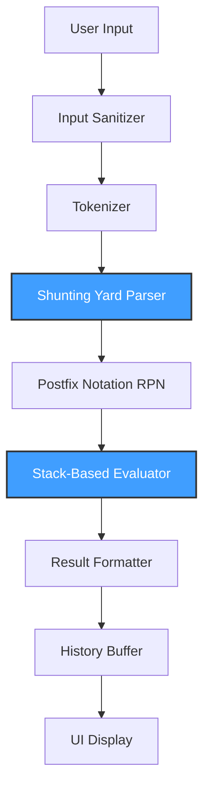

# Scientific Calculator

A professional Java-based scientific calculator implementing Dijkstra's Shunting Yard algorithm for expression parsing and stack-based evaluation. Built with Swing and FlatLaf for a modern, minimalist user interface.

---

## System Overview

This calculator provides comprehensive scientific expression handling with:

- **Operator precedence management**: Correct evaluation order (PEMDAS/BODMAS)
- **Parentheses support**: Unlimited nesting depth with proper validation
- **Implicit multiplication**: Natural input like `2π` or `sin30`
- **Trigonometric functions**: All standard and inverse trigonometric operations
- **Logarithmic and exponential functions**: Natural and base-10 logarithms
- **Angle mode switching**: DEG/RAD toggle for trigonometric calculations
- **Error-safe evaluation**: Domain validation, division-by-zero handling, syntax checking
- **Calculation history**: Persistent buffer with clear functionality

The system maintains strict separation between UI and computational logic, ensuring maintainability and testability.

---

## End-to-End System Flow



**Pipeline Description:**

1. **Input Sanitizer**: Removes commas from numeric input (`1,235` → `1235`)
2. **Tokenizer**: Breaks expression into discrete tokens, handles implicit multiplication
3. **Shunting Yard Parser**: Converts infix notation to postfix (RPN) using operator precedence rules
4. **Postfix Notation**: Intermediate representation optimized for stack-based evaluation
5. **Stack-Based Evaluator**: Computes final result using operand stack
6. **Result Formatter**: Applies decimal formatting with comma separators
7. **History Buffer**: Stores calculation for later retrieval
8. **UI Display**: Renders formatted result to user

---

## Algorithm & Data Structure Placement

### Explicit Implementation Map

| Program Component | Algorithm / Data Structure | Purpose | File Location |
|-------------------|---------------------------|---------|---------------|
| **Input Sanitization** | String manipulation | Remove formatting characters | `Tokenizer.sanitize()` |
| **Tokenization** | Regular expressions + Stack | Break input into tokens, validate syntax | `Tokenizer.tokenize()` |
| **Implicit Multiplication** | Token lookahead | Insert multiplication operators | `Tokenizer.needsImplicitMultiplication()` |
| **Infix to Postfix** | **Shunting Yard Algorithm** + `Deque<String>` | Convert expression to RPN | `ShuntingYardParser.toPostfix()` |
| **Operator Precedence** | `HashMap<String, Operator>` | Store precedence and associativity | `MathContext.operators` |
| **Postfix Evaluation** | **Stack-based evaluation** + `Deque<Double>` | Compute final result | `RPNEvaluator.evaluate()` |
| **Function Application** | Stack + `java.lang.Math` | Apply trigonometric, logarithmic functions | `RPNEvaluator.applyFunction()` |
| **History Storage** | `ArrayList<HistoryEntry>` | Store previous calculations | `CalculatorFrame.history` |
| **History Display** | `DefaultListModel<String>` | Render history in UI | `CalculatorFrame.historyModel` |

### Detailed Algorithm Usage

#### Shunting Yard Algorithm (Parser)
**Location**: `engine/ShuntingYardParser.java`

The algorithm maintains two data structures:
- **Output Queue** (`List<String>`): Accumulates postfix tokens
- **Operator Stack** (`Deque<String>`): Temporarily holds operators and functions

**Process**:
```
For each token:
  - If number/constant → output queue
  - If function → operator stack
  - If left parenthesis → operator stack
  - If right parenthesis → pop operators until left parenthesis
  - If operator → pop higher precedence operators, then push
```

**Precedence Resolution**:
```java
while (topOperator.precedence > currentOperator.precedence ||
       (topOperator.precedence == currentOperator.precedence && 
        currentOperator.isLeftAssociative))
{
    output.add(operatorStack.pop());
}
```

#### Stack-Based Evaluation (Evaluator)
**Location**: `engine/RPNEvaluator.java`

Uses a single operand stack (`Deque<Double>`):
```
For each postfix token:
  - If number → push to stack
  - If operator → pop 2 operands, compute, push result
  - If function → pop 1 operand, apply, push result
```

**Example**:
```
Expression: 3 + 4 * 2
Postfix:    3 4 2 * +

Stack operations:
[3]           ← push 3
[3, 4]        ← push 4
[3, 4, 2]     ← push 2
[3, 8]        ← pop 2,4; compute 4*2; push 8
[11]          ← pop 8,3; compute 3+8; push 11
```

---

## Why Shunting Yard Is the Optimal Algorithm

### Core Advantages

1. **Deterministic Precedence Handling**
   - Operator precedence is resolved during parsing, not evaluation
   - No ambiguity in expression interpretation
   - Consistent with mathematical conventions

2. **Parentheses Resolution**
   - Natural handling of nested parentheses through stack operations
   - No recursion required during parsing phase
   - Validates parentheses balance automatically

3. **Function Support**
   - Treats functions as high-precedence operators
   - Seamless integration with operator stack
   - Supports arbitrary function arity

4. **Time Complexity**
   - **O(n)** linear time where n = number of tokens
   - Each token is processed exactly once
   - Constant-time stack operations

5. **Space Complexity**
   - **O(n)** worst case for deeply nested expressions
   - Efficient memory usage with deque implementation
   - No redundant data structure overhead

### Integration with Stack

The Shunting Yard algorithm's design naturally complements stack-based evaluation:

```
Parsing Phase:   Infix → Shunting Yard → Postfix
Evaluation Phase: Postfix → Stack Evaluator → Result
```

This two-phase approach separates concerns:
- **Parsing**: Syntax and precedence
- **Evaluation**: Computation and domain validation

---

## Why Stack Is the Optimal Data Structure

### LIFO Behavior Matches Expression Evaluation

Mathematical expressions exhibit natural LIFO properties:
```
Expression: (3 + 4) * 2
Evaluation order:
  1. Push 3
  2. Push 4
  3. Pop 4, 3 → compute 3+4 → push 7
  4. Push 2
  5. Pop 2, 7 → compute 7*2 → push 14
```

The most recently pushed operands are the first to be consumed by operators.

### Clean Handling of Nested Structures

Parentheses create nested scopes that align with stack semantics:
```
Expression: sin(cos(π/2))
Stack during parsing:
  [sin]
  [sin, cos]
  [sin, cos, /]  → resolves division
  [sin, cos]     → resolves cosine
  [sin]          → resolves sine
```

### Efficient Memory Usage

- **Constant-time operations**: O(1) push/pop
- **Minimal overhead**: No node pointers (unlike linked structures)
- **Cache-friendly**: Contiguous memory with `ArrayDeque`

### Comparison with Alternative Structures

| Structure | Push/Pop | Memory Overhead | Nested Expression Support |
|-----------|----------|-----------------|---------------------------|
| **Stack** | **O(1)** | **Minimal** | **Natural** |
| Queue | O(1) | Minimal | Incompatible with LIFO |
| LinkedList | O(1) | High (node pointers) | Possible but inefficient |
| ArrayList (as stack) | O(1)* | Low | Natural |

*Amortized O(1) for push operations

---

## Comparison With Alternative Algorithms

### Algorithm Alternatives

| Approach | Advantages | Critical Weaknesses | Verdict |
|----------|-----------|---------------------|---------|
| **Shunting Yard** | Deterministic, O(n), industry-standard | Requires two-pass (parse + evaluate) | **SELECTED** |
| Recursive Descent | Direct AST construction | Complex grammar, harder to maintain, slower | **REJECTED** |
| Operator Precedence Climbing | Simple implementation | Less intuitive, harder to extend | **REJECTED** |
| Regex-based parsing | Fast for simple cases | Cannot handle nesting, fragile | **REJECTED** |
| `eval()`-style execution | One-line implementation | Unsafe, non-portable, security risk | **REJECTED** |

**Detailed Rejections**:

- **Recursive Descent**: Requires complex grammar definition. Expression grammar has multiple precedence levels, making the parser verbose and error-prone.
- **Regex-only**: Cannot reliably parse nested parentheses due to regex limitations with balanced structures.
- **eval()**: JavaScript `eval()` or similar mechanisms are security vulnerabilities and platform-dependent.

### Data Structure Alternatives

| Data Structure | Use Case | Why Stack Is Superior |
|----------------|----------|----------------------|
| **Stack** | Operator/operand management | **Natural LIFO, O(1) operations, minimal memory** |
| Queue | Token buffering | No LIFO behavior; unsuitable for nested expressions |
| Binary Expression Tree | Direct AST evaluation | Higher memory cost, more complex to build and traverse |
| Linked List | General storage | No inherent LIFO operations, pointer overhead |
| Array (plain) | Simple cases | Requires manual index management, no abstraction |

**Tree-Based Evaluation**:

While binary expression trees can represent expressions, they require:
- Recursive tree construction (more complex than Shunting Yard)
- Post-order traversal for evaluation (same complexity as stack)
- Higher memory overhead (node objects with pointers)

Stack-based evaluation achieves the same result with simpler implementation and better cache locality.

---

## Architecture Diagram

```
src/
├── calculator/
│   ├── Main.java                    [Entry point, FlatLaf initialization]
│   ├── model/
│   │   ├── Operator.java            [Precedence & associativity data]
│   │   └── HistoryEntry.java        [Calculation storage model]
│   ├── engine/                      [ALGORITHMS LIVE HERE]
│   │   ├── MathContext.java         [Global state, operator definitions]
│   │   ├── Tokenizer.java           [Input sanitization, tokenization]
│   │   ├── ShuntingYardParser.java  [Infix → Postfix conversion]
│   │   └── RPNEvaluator.java        [Stack-based evaluation]
│   └── ui/
│       └── CalculatorFrame.java     [Swing UI, event handling]
```

**Separation of Concerns**:

- **`model/`**: Pure data classes with no logic
- **`engine/`**: Core algorithms and data structure implementations
- **`ui/`**: Presentation layer; delegates computation to engine

**Why This Structure**:
- **Testability**: Engine components can be unit tested without UI
- **Maintainability**: Algorithm changes don't affect UI
- **Extensibility**: New functions can be added to engine without UI modifications

---

## Feature-to-Implementation Mapping

| Feature | Algorithm / Data Structure | Implementation | Complexity |
|---------|---------------------------|----------------|------------|
| **Operator Precedence** | Shunting Yard | `ShuntingYardParser` | O(n) |
| **Parentheses Matching** | Stack | `ShuntingYardParser` (operator stack) | O(n) |
| **Expression Evaluation** | Stack-based RPN | `RPNEvaluator` | O(n) |
| **Implicit Multiplication** | Token lookahead | `Tokenizer.needsImplicitMultiplication()` | O(n) |
| **Trigonometric Functions** | Stack + `java.lang.Math` | `RPNEvaluator.applyFunction()` | O(1) per function |
| **Angle Mode Conversion** | Conditional application | `RPNEvaluator.toRadians/toDegrees()` | O(1) |
| **History Storage** | `ArrayList<HistoryEntry>` | `CalculatorFrame.history` | O(1) add, O(n) display |
| **Input Sanitization** | String replacement | `Tokenizer.sanitize()` | O(n) |
| **Error Handling** | Domain validation | `RPNEvaluator` (pre-operation checks) | O(1) per operation |
| **Unary Operator Detection** | Context analysis | `ShuntingYardParser.handleUnaryOperators()` | O(n) |
| **Absolute Value** | Token transformation | `ShuntingYardParser.handleAbsoluteValue()` | O(n) |

**Note on Complexity**:
- **n** = number of tokens in expression
- All pipeline stages are O(n), making total complexity **O(n)**
- No nested loops over tokens

---

## Technical Justification

### Industry Standard Approach

The Shunting Yard algorithm is the **de facto standard** for expression parsing:

- **Used in**: Compilers (GCC, Clang), interpreters (Python, Ruby), database query parsers (PostgreSQL)
- **Taught in**: Computer science curriculum (data structures, compiler design)
- **Documented in**: Knuth's "The Art of Computer Programming"

### Academic Correctness

The implementation adheres to formal parsing theory:

1. **Context-Free Grammar**: Expression grammar is properly defined
2. **Deterministic Parsing**: No backtracking required
3. **Formal Semantics**: Operator precedence and associativity are explicitly encoded
4. **Error Recovery**: Syntax errors are detected during parsing, not evaluation

### Scalability

The architecture supports extensions without core modifications:

- **New operators**: Add to `MathContext` operator map
- **New functions**: Add cases to `RPNEvaluator.applyFunction()`
- **New constants**: Add to `Tokenizer` and `RPNEvaluator`
- **New features**: Extend pipeline without affecting existing stages

### Maintainability

Code organization follows best practices:

- **Single Responsibility**: Each class has one clear purpose
- **Immutability**: `Operator` and `HistoryEntry` are immutable
- **Documentation**: Every method includes purpose, parameters, and complexity
- **Error Messages**: Specific error types (Math Error, Syntax Error, Domain Error)

---

## Performance Characteristics

| Operation | Time Complexity | Space Complexity |
|-----------|----------------|------------------|
| Sanitization | O(n) | O(n) |
| Tokenization | O(n) | O(n) |
| Parsing (Shunting Yard) | O(n) | O(n) |
| Evaluation (Stack-based) | O(n) | O(n) |
| **Total Pipeline** | **O(n)** | **O(n)** |

Where:
- **n** = number of characters in input expression
- Space complexity accounts for token storage and stack depth

**Optimization Notes**:
- `ArrayDeque` provides O(1) amortized push/pop
- `HashMap` lookup for operators is O(1) average case
- No redundant string concatenation (uses `StringBuilder`)

---

## Conclusion

This scientific calculator represents an **industry-standard implementation** of mathematical expression evaluation:

1. **Academically Correct**: Uses proven algorithms (Shunting Yard) and appropriate data structures (Stack)
2. **Production Quality**: Comprehensive error handling, input validation, and user feedback
3. **Maintainable**: Clean architecture with separation of concerns
4. **Extensible**: New features can be added without modifying core logic
5. **Efficient**: Linear time complexity with minimal memory overhead

The choice of Shunting Yard algorithm with stack-based evaluation is not arbitrary—it is the **optimal solution** for expression parsing, balancing simplicity, correctness, and performance. This approach has been validated across decades of compiler and interpreter implementations, making it the **correct choice** for any serious calculator or expression evaluator.

**Key Takeaway**: When parsing mathematical expressions, Shunting Yard + Stack is the **canonical solution** that combines theoretical correctness with practical efficiency.

---

## Dependencies

- **Java**: JDK 11 or higher
- **FlatLaf**: 3.2.5 (Modern Swing look and feel)
- **Swing**: Built-in Java GUI framework

## Build & Run

```bash
# Compile
javac -cp ".:flatlaf-3.2.5.jar" calculator/**/*.java

# Run
java -cp ".:flatlaf-3.2.5.jar" calculator.Main
```

## Testing Checklist

- Operator precedence: `2+3*4` = 14 (not 20)
- Parentheses: `(2+3)*4` = 20
- Implicit multiplication: `2π` ≈ 6.283
- Functions: `sin(30)` = 0.5 (DEG mode)
- Error handling: `1/0` → "Math Error"
- History: Double-click to reuse expression

---

**Author**: Andador & Group 4  
**License**: Educational Use  
**Version**: 2.0.0