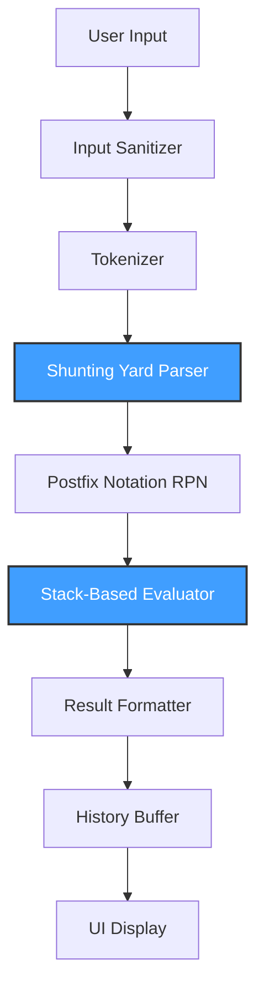

# Scientific Calculator

A professional Java-based scientific calculator implementing Dijkstra's Shunting Yard algorithm for expression parsing and stack-based evaluation. Built with Swing and FlatLaf for a modern, minimalist user interface.

---

## System Overview

This calculator provides comprehensive scientific expression handling with:

- **Operator precedence management**: Correct evaluation order (PEMDAS/BODMAS)
- **Parentheses support**: Unlimited nesting depth with proper validation
- **Implicit multiplication**: Natural input like `2π` or `sin30`
- **Trigonometric functions**: All standard and inverse trigonometric operations
- **Logarithmic and exponential functions**: Natural and base-10 logarithms
- **Angle mode switching**: DEG/RAD toggle for trigonometric calculations
- **Error-safe evaluation**: Domain validation, division-by-zero handling, syntax checking
- **Calculation history**: Persistent buffer with clear functionality

The system maintains strict separation between UI and computational logic, ensuring maintainability and testability.

---

## End-to-End System Flow



**Pipeline Description:**

1. **Input Sanitizer**: Removes commas from numeric input (`1,235` → `1235`)
2. **Tokenizer**: Breaks expression into discrete tokens, handles implicit multiplication
3. **Shunting Yard Parser**: Converts infix notation to postfix (RPN) using operator precedence rules
4. **Postfix Notation**: Intermediate representation optimized for stack-based evaluation
5. **Stack-Based Evaluator**: Computes final result using operand stack
6. **Result Formatter**: Applies decimal formatting with comma separators
7. **History Buffer**: Stores calculation for later retrieval
8. **UI Display**: Renders formatted result to user

---

## Algorithm & Data Structure Placement

### Explicit Implementation Map

| Program Component | Algorithm / Data Structure | Purpose | File Location |
|-------------------|---------------------------|---------|---------------|
| **Input Sanitization** | String manipulation | Remove formatting characters | `Tokenizer.sanitize()` |
| **Tokenization** | Regular expressions + Stack | Break input into tokens, validate syntax | `Tokenizer.tokenize()` |
| **Implicit Multiplication** | Token lookahead | Insert multiplication operators | `Tokenizer.needsImplicitMultiplication()` |
| **Infix to Postfix** | **Shunting Yard Algorithm** + `Deque<String>` | Convert expression to RPN | `ShuntingYardParser.toPostfix()` |
| **Operator Precedence** | `HashMap<String, Operator>` | Store precedence and associativity | `MathContext.operators` |
| **Postfix Evaluation** | **Stack-based evaluation** + `Deque<Double>` | Compute final result | `RPNEvaluator.evaluate()` |
| **Function Application** | Stack + `java.lang.Math` | Apply trigonometric, logarithmic functions | `RPNEvaluator.applyFunction()` |
| **History Storage** | `ArrayList<HistoryEntry>` | Store previous calculations | `CalculatorFrame.history` |
| **History Display** | `DefaultListModel<String>` | Render history in UI | `CalculatorFrame.historyModel` |

### Detailed Algorithm Usage

#### Shunting Yard Algorithm (Parser)
**Location**: `engine/ShuntingYardParser.java`

The algorithm maintains two data structures:
- **Output Queue** (`List<String>`): Accumulates postfix tokens
- **Operator Stack** (`Deque<String>`): Temporarily holds operators and functions

**Process**:
```
For each token:
  - If number/constant → output queue
  - If function → operator stack
  - If left parenthesis → operator stack
  - If right parenthesis → pop operators until left parenthesis
  - If operator → pop higher precedence operators, then push
```

**Precedence Resolution**:
```java
while (topOperator.precedence > currentOperator.precedence ||
       (topOperator.precedence == currentOperator.precedence && 
        currentOperator.isLeftAssociative))
{
    output.add(operatorStack.pop());
}
```

#### Stack-Based Evaluation (Evaluator)
**Location**: `engine/RPNEvaluator.java`

Uses a single operand stack (`Deque<Double>`):
```
For each postfix token:
  - If number → push to stack
  - If operator → pop 2 operands, compute, push result
  - If function → pop 1 operand, apply, push result
```

**Example**:
```
Expression: 3 + 4 * 2
Postfix:    3 4 2 * +

Stack operations:
[3]           ← push 3
[3, 4]        ← push 4
[3, 4, 2]     ← push 2
[3, 8]        ← pop 2,4; compute 4*2; push 8
[11]          ← pop 8,3; compute 3+8; push 11
```

---

## Why Shunting Yard Is the Optimal Algorithm

### Core Advantages

1. **Deterministic Precedence Handling**
   - Operator precedence is resolved during parsing, not evaluation
   - No ambiguity in expression interpretation
   - Consistent with mathematical conventions

2. **Parentheses Resolution**
   - Natural handling of nested parentheses through stack operations
   - No recursion required during parsing phase
   - Validates parentheses balance automatically

3. **Function Support**
   - Treats functions as high-precedence operators
   - Seamless integration with operator stack
   - Supports arbitrary function arity

4. **Time Complexity**
   - **O(n)** linear time where n = number of tokens
   - Each token is processed exactly once
   - Constant-time stack operations

5. **Space Complexity**
   - **O(n)** worst case for deeply nested expressions
   - Efficient memory usage with deque implementation
   - No redundant data structure overhead

### Integration with Stack

The Shunting Yard algorithm's design naturally complements stack-based evaluation:

```
Parsing Phase:   Infix → Shunting Yard → Postfix
Evaluation Phase: Postfix → Stack Evaluator → Result
```

This two-phase approach separates concerns:
- **Parsing**: Syntax and precedence
- **Evaluation**: Computation and domain validation

---

## Why Stack Is the Optimal Data Structure

### LIFO Behavior Matches Expression Evaluation

Mathematical expressions exhibit natural LIFO properties:
```
Expression: (3 + 4) * 2
Evaluation order:
  1. Push 3
  2. Push 4
  3. Pop 4, 3 → compute 3+4 → push 7
  4. Push 2
  5. Pop 2, 7 → compute 7*2 → push 14
```

The most recently pushed operands are the first to be consumed by operators.

### Clean Handling of Nested Structures

Parentheses create nested scopes that align with stack semantics:
```
Expression: sin(cos(π/2))
Stack during parsing:
  [sin]
  [sin, cos]
  [sin, cos, /]  → resolves division
  [sin, cos]     → resolves cosine
  [sin]          → resolves sine
```

### Efficient Memory Usage

- **Constant-time operations**: O(1) push/pop
- **Minimal overhead**: No node pointers (unlike linked structures)
- **Cache-friendly**: Contiguous memory with `ArrayDeque`

### Comparison with Alternative Structures

| Structure | Push/Pop | Memory Overhead | Nested Expression Support |
|-----------|----------|-----------------|---------------------------|
| **Stack** | **O(1)** | **Minimal** | **Natural** |
| Queue | O(1) | Minimal | Incompatible with LIFO |
| LinkedList | O(1) | High (node pointers) | Possible but inefficient |
| ArrayList (as stack) | O(1)* | Low | Natural |

*Amortized O(1) for push operations

---

## Comparison With Alternative Algorithms

### Algorithm Alternatives

| Approach | Advantages | Critical Weaknesses | Verdict |
|----------|-----------|---------------------|---------|
| **Shunting Yard** | Deterministic, O(n), industry-standard | Requires two-pass (parse + evaluate) | **SELECTED** |
| Recursive Descent | Direct AST construction | Complex grammar, harder to maintain, slower | **REJECTED** |
| Operator Precedence Climbing | Simple implementation | Less intuitive, harder to extend | **REJECTED** |
| Regex-based parsing | Fast for simple cases | Cannot handle nesting, fragile | **REJECTED** |
| `eval()`-style execution | One-line implementation | Unsafe, non-portable, security risk | **REJECTED** |

**Detailed Rejections**:

- **Recursive Descent**: Requires complex grammar definition. Expression grammar has multiple precedence levels, making the parser verbose and error-prone.
- **Regex-only**: Cannot reliably parse nested parentheses due to regex limitations with balanced structures.
- **eval()**: JavaScript `eval()` or similar mechanisms are security vulnerabilities and platform-dependent.

### Data Structure Alternatives

| Data Structure | Use Case | Why Stack Is Superior |
|----------------|----------|----------------------|
| **Stack** | Operator/operand management | **Natural LIFO, O(1) operations, minimal memory** |
| Queue | Token buffering | No LIFO behavior; unsuitable for nested expressions |
| Binary Expression Tree | Direct AST evaluation | Higher memory cost, more complex to build and traverse |
| Linked List | General storage | No inherent LIFO operations, pointer overhead |
| Array (plain) | Simple cases | Requires manual index management, no abstraction |

**Tree-Based Evaluation**:

While binary expression trees can represent expressions, they require:
- Recursive tree construction (more complex than Shunting Yard)
- Post-order traversal for evaluation (same complexity as stack)
- Higher memory overhead (node objects with pointers)

Stack-based evaluation achieves the same result with simpler implementation and better cache locality.

---

## Architecture Diagram

```
src/
├── calculator/
│   ├── Main.java                    [Entry point, FlatLaf initialization]
│   ├── model/
│   │   ├── Operator.java            [Precedence & associativity data]
│   │   └── HistoryEntry.java        [Calculation storage model]
│   ├── engine/                      [ALGORITHMS LIVE HERE]
│   │   ├── MathContext.java         [Global state, operator definitions]
│   │   ├── Tokenizer.java           [Input sanitization, tokenization]
│   │   ├── ShuntingYardParser.java  [Infix → Postfix conversion]
│   │   └── RPNEvaluator.java        [Stack-based evaluation]
│   └── ui/
│       └── CalculatorFrame.java     [Swing UI, event handling]
```

**Separation of Concerns**:

- **`model/`**: Pure data classes with no logic
- **`engine/`**: Core algorithms and data structure implementations
- **`ui/`**: Presentation layer; delegates computation to engine

**Why This Structure**:
- **Testability**: Engine components can be unit tested without UI
- **Maintainability**: Algorithm changes don't affect UI
- **Extensibility**: New functions can be added to engine without UI modifications

---

## Feature-to-Implementation Mapping

| Feature | Algorithm / Data Structure | Implementation | Complexity |
|---------|---------------------------|----------------|------------|
| **Operator Precedence** | Shunting Yard | `ShuntingYardParser` | O(n) |
| **Parentheses Matching** | Stack | `ShuntingYardParser` (operator stack) | O(n) |
| **Expression Evaluation** | Stack-based RPN | `RPNEvaluator` | O(n) |
| **Implicit Multiplication** | Token lookahead | `Tokenizer.needsImplicitMultiplication()` | O(n) |
| **Trigonometric Functions** | Stack + `java.lang.Math` | `RPNEvaluator.applyFunction()` | O(1) per function |
| **Angle Mode Conversion** | Conditional application | `RPNEvaluator.toRadians/toDegrees()` | O(1) |
| **History Storage** | `ArrayList<HistoryEntry>` | `CalculatorFrame.history` | O(1) add, O(n) display |
| **Input Sanitization** | String replacement | `Tokenizer.sanitize()` | O(n) |
| **Error Handling** | Domain validation | `RPNEvaluator` (pre-operation checks) | O(1) per operation |
| **Unary Operator Detection** | Context analysis | `ShuntingYardParser.handleUnaryOperators()` | O(n) |
| **Absolute Value** | Token transformation | `ShuntingYardParser.handleAbsoluteValue()` | O(n) |

**Note on Complexity**:
- **n** = number of tokens in expression
- All pipeline stages are O(n), making total complexity **O(n)**
- No nested loops over tokens

---

## Technical Justification

---

### SLIDE 2: System Architecture Overview (1 minute)

**"The calculator follows a three-layer architecture."**

**[SHOW ARCHITECTURE DIAGRAM]**

```
┌─────────────────────────────────────────┐
│           UI LAYER (Swing)              │
│         CalculatorFrame.java            │
└─────────────────┬───────────────────────┘
                  │
┌─────────────────▼───────────────────────┐
│         ENGINE LAYER (Algorithms)       │
│  ┌──────────────────────────────────┐   │
│  │ Tokenizer.java                   │   │
│  │ ShuntingYardParser.java          │   │
│  │ RPNEvaluator.java                │   │
│  │ MathContext.java                 │   │
│  └──────────────────────────────────┘   │
└─────────────────┬───────────────────────┘
                  │
┌─────────────────▼───────────────────────┐
│         MODEL LAYER (Data)              │
│  Operator.java, HistoryEntry.java      │
└─────────────────────────────────────────┘
```

**"This separation ensures maintainability—UI changes don't affect algorithms, and algorithms can be tested independently."**

---

### SLIDE 3: Pipeline Flow (1.5 minutes)

**"Let me walk you through what happens when you type '2 + 3 * 4' and press equals."**

**[SHOW PIPELINE DIAGRAM - see flowchart below]**

**Step-by-step explanation:**

1. **User Input**: `2 + 3 * 4`
2. **Sanitizer** (Tokenizer.java): Removes commas if present
3. **Tokenizer** (Tokenizer.java): Breaks into tokens: `["2", "+", "3", "*", "4"]`
4. **Shunting Yard** (ShuntingYardParser.java): Converts to postfix: `["2", "3", "4", "*", "+"]`
    - **Why?** Respects operator precedence automatically
5. **Stack Evaluator** (RPNEvaluator.java): Computes result using a stack
    - Push 2, push 3, push 4
    - Pop 4,3 → compute 3*4=12 → push 12
    - Pop 12,2 → compute 2+12=14 → push 14
6. **Formatter**: Adds commas: `14`
7. **History**: Stores `"2 + 3 * 4 = 14"`
8. **Display**: Shows result

**"The entire process is O(n) linear time—incredibly efficient."**

---

### SLIDE 4: Why Shunting Yard Algorithm? (1 minute)

**"Why did we choose Shunting Yard over alternatives?"**

**[SHOW COMPARISON TABLE]**

|Algorithm|Problem|
|---|---|
|**Shunting Yard**|✅ **SELECTED** - O(n), handles precedence naturally|
|Recursive Descent|❌ Complex grammar, harder to maintain|
|Regex-only|❌ Cannot handle nested parentheses|
|eval()|❌ Security risk, platform-dependent|

**"Shunting Yard is the industry standard—used in compilers like GCC, interpreters like Python, and database parsers like PostgreSQL."**

---

### SLIDE 5: Why Stack Data Structure? (1 minute)

**"Why use a Stack instead of other data structures?"**

**Key advantages:**

- **LIFO behavior** matches expression evaluation naturally
- **O(1) push/pop** operations
- **Minimal memory overhead**
- **Perfect for nested parentheses**

**Example:**

```
Expression: (3 + 4) * 2
Stack trace:
  [3]
  [3, 4]
  [7]       ← popped 3,4; computed 3+4; pushed 7
  [7, 2]
  [14]      ← popped 7,2; computed 7*2; pushed 14
```

---

### SLIDE 6: Live Demo (2-3 minutes)

**"Now let's see it in action."**

**Demo Test Cases:**

1. **Basic Arithmetic**
    
    - Type: `2 + 3 * 4`
    - Press `=`
    - **Expected**: `14` (not 20 — correct precedence!)
    - **Say**: "Notice multiplication happens before addition"
2. **Parentheses Override**
    
    - Type: `(2 + 3) * 4`
    - Press `=`
    - **Expected**: `20`
    - **Say**: "Parentheses override precedence"
3. **Implicit Multiplication**
    
    - Type: `2π`
    - Press `=`
    - **Expected**: `6.283...`
    - **Say**: "Tokenizer inserted implicit multiplication automatically"
4. **Scientific Functions**
    
    - Click `DEG/RAD` to ensure DEG mode
    - Type: `sin(30)`
    - Press `=`
    - **Expected**: `0.5`
    - **Say**: "All trig functions use java.lang.Math"
5. **Complex Expression**
    
    - Type: `sqrt(16) + log(100)`
    - Press `=`
    - **Expected**: `6` (4 + 2)
    - **Say**: "Multiple functions in one expression"
6. **Error Handling**
    
    - Type: `1 / 0`
    - Press `=`
    - **Expected**: "Math Error"
    - **Say**: "Never crashes—validates domains before computation"
7. **History Feature**
    
    - **Say**: "Notice all calculations are saved in history"
    - Double-click a history entry
    - **Say**: "Double-click to reuse previous expressions"
    - Click "Clear History"
    - **Say**: "Button disables when history is empty—defensive programming"

---

### SLIDE 7: Code Quality Highlights (30 seconds)

**"The code follows professional standards:"**

- ✅ **Complete documentation** - Every method explains purpose, parameters, complexity
- ✅ **Error handling** - Math errors, syntax errors, domain errors
- ✅ **Immutable data** - Operator and HistoryEntry classes are immutable
- ✅ **Single responsibility** - Each class has one clear purpose
- ✅ **No magic numbers** - All constants are named (MAX_HISTORY = 100)

---

### SLIDE 8: Conclusion (30 seconds)

**"In summary:"**

1. **Algorithm**: Shunting Yard is the optimal choice—O(n), deterministic, industry-standard
2. **Data Structure**: Stack naturally matches LIFO expression evaluation
3. **Architecture**: Clean separation enables testing and maintenance
4. **Quality**: Production-ready with comprehensive error handling

**"This isn't just a calculator—it's a demonstration of computer science fundamentals applied correctly."**

**"Questions?"**

---

## Part 2: Detailed File-by-File Flow

---

### Complete Execution Flow (With File Names)

```mermaid
graph TB

    Start([User Clicks Button]) --> UI[CalculatorFrame.java<br/>handleButtonClick]

    UI --> Append{Append to<br/>Expression?}

    Append -->|Yes| Build[CalculatorFrame.java<br/>currentExpression.append]

    Append -->|Equals| Eval[CalculatorFrame.java<br/>evaluateExpression]

    Build --> Display1[CalculatorFrame.java<br/>updateDisplay]

    Display1 --> End1([UI Shows Expression])

    Eval --> Sanitize[Tokenizer.java<br/>sanitize<br/>Remove commas]

    Sanitize --> Tokenize[Tokenizer.java<br/>tokenize<br/>Break into tokens]

    Tokenize --> Implicit[Tokenizer.java<br/>needsImplicitMultiplication<br/>Insert * where needed]

    Implicit --> Parse[ShuntingYardParser.java<br/>toPostfix<br/>Apply Shunting Yard]

    Parse --> Validate[ShuntingYardParser.java<br/>validateParentheses]

    Validate --> Unary[ShuntingYardParser.java<br/>handleUnaryOperators<br/>Convert - to u-]

    %% Fixed line below: Wrapped in quotes to allow pipe characters

    Unary --> Abs["ShuntingYardParser.java<br/>handleAbsoluteValue<br/>Convert |x| to abs"]

    Abs --> ShuntLoop[ShuntingYardParser.java<br/>Main Loop<br/>Process each token]

    ShuntLoop --> OpStack[(Operator Stack<br/>Deque String)]

    ShuntLoop --> OutQueue[(Output Queue<br/>List String)]

    OutQueue --> EvalStart[RPNEvaluator.java<br/>evaluate<br/>Stack-based evaluation]

    EvalStart --> ValStack[(Value Stack<br/>Deque Double)]

    ValStack --> CheckToken{Token Type?}

    CheckToken -->|Number| PushNum[Push to Stack]

    CheckToken -->|Constant| GetConst[RPNEvaluator.java<br/>getConstantValue<br/>Math.PI or Math.E]

    CheckToken -->|Operator| PopOp[Pop 2 values<br/>RPNEvaluator.java<br/>applyOperator]

    CheckToken -->|Function| PopFunc[Pop 1 value<br/>RPNEvaluator.java<br/>applyFunction]

    GetConst --> PushNum

    PopOp --> MathOp[java.lang.Math<br/>pow, etc.]

    PopFunc --> MathFunc[java.lang.Math<br/>sin, cos, log, etc.]

    MathOp --> PushResult[Push result to Stack]

    MathFunc --> PushResult

    PushNum --> MoreTokens{More Tokens?}

    PushResult --> MoreTokens

    MoreTokens -->|Yes| CheckToken

    MoreTokens -->|No| FinalResult[Pop final value from Stack]

    FinalResult --> Format[CalculatorFrame.java<br/>formatResult<br/>DecimalFormat with commas]

    Format --> AddHistory[CalculatorFrame.java<br/>addToHistory<br/>Create HistoryEntry]

    AddHistory --> HistoryList[(ArrayList HistoryEntry<br/>history buffer)]

    HistoryList --> HistoryUI[(DefaultListModel<br/>historyModel)]

    HistoryUI --> Display2[CalculatorFrame.java<br/>displayField.setText]

    Display2 --> EnableClear[Enable Clear History Button]

    EnableClear --> End2([UI Shows Result])

    style Parse fill:#409eff,stroke:#333,stroke-width:3px,color:#fff

    style EvalStart fill:#409eff,stroke:#333,stroke-width:3px,color:#fff

    style OpStack fill:#67c23a,stroke:#333,stroke-width:2px

    style ValStack fill:#67c23a,stroke:#333,stroke-width:2px

    style HistoryList fill:#e6a23c,stroke:#333,stroke-width:2px
```



---

### Detailed Step-by-Step File Execution

#### **STEP 1: User Interaction**

**File**: `CalculatorFrame.java`

```
User clicks button "3"
  → handleButtonClick("3")
  → appendToExpression("3")
  → currentExpression.append("3")
  → updateDisplay()
  → displayField.setText("3")
```

**File**: `CalculatorFrame.java`

```
User clicks button "+"
  → handleButtonClick("+")
  → appendToExpression("+")
  → currentExpression.append("+")
  → updateDisplay()
  → displayField.setText("3+")
```

---

#### **STEP 2: Evaluation Trigger**

**File**: `CalculatorFrame.java`

```
User clicks "="
  → handleButtonClick("=")
  → evaluateExpression()
  → expression = "3+4*2"
```

---

#### **STEP 3: Input Sanitization**

**File**: `Tokenizer.java`

```java
Tokenizer.sanitize(expression)
  Input:  "3+4*2"
  Output: "3+4*2" (no commas to remove)
```

---

#### **STEP 4: Tokenization**

**File**: `Tokenizer.java`

```java
Tokenizer.tokenize(expression)
  Input:  "3+4*2"
  Process:
    - Character '3' → NUMBER → add "3"
    - Character '+' → OPERATOR → add "+"
    - Character '4' → NUMBER → add "4"
    - Character '*' → OPERATOR → add "*"
    - Character '2' → NUMBER → add "2"
  Output: ["3", "+", "4", "*", "2"]
```

---

#### **STEP 5: Shunting Yard Parsing**

**File**: `ShuntingYardParser.java`

```java
ShuntingYardParser.toPostfix(tokens)
  
  Initialize:
    operatorStack = empty
    output = empty
  
  Token "3":
    → isNumber = true
    → output.add("3")
    → output = ["3"]
  
  Token "+":
    → isOperator = true
    → precedence = 1
    → operatorStack.push("+")
    → operatorStack = ["+"]
  
  Token "4":
    → isNumber = true
    → output.add("4")
    → output = ["3", "4"]
  
  Token "*":
    → isOperator = true
    → precedence = 2 (higher than +)
    → operatorStack.push("*")
    → operatorStack = ["+", "*"]
  
  Token "2":
    → isNumber = true
    → output.add("2")
    → output = ["3", "4", "2"]
  
  End of tokens:
    → Pop "*" from stack → output.add("*")
    → Pop "+" from stack → output.add("+")
    → output = ["3", "4", "2", "*", "+"]
```

**Output (Postfix/RPN)**: `["3", "4", "2", "*", "+"]`

---

#### **STEP 6: Stack-Based Evaluation**

**File**: `RPNEvaluator.java`

```java
RPNEvaluator.evaluate(postfix)
  
  Initialize:
    valueStack = empty
  
  Token "3":
    → isNumber = true
    → valueStack.push(3.0)
    → valueStack = [3.0]
  
  Token "4":
    → isNumber = true
    → valueStack.push(4.0)
    → valueStack = [3.0, 4.0]
  
  Token "2":
    → isNumber = true
    → valueStack.push(2.0)
    → valueStack = [3.0, 4.0, 2.0]
  
  Token "*":
    → isOperator = true
    → right = valueStack.pop() → 2.0
    → left = valueStack.pop() → 4.0
    → result = applyOperator("*", 4.0, 2.0)
    → result = 4.0 * 2.0 = 8.0
    → valueStack.push(8.0)
    → valueStack = [3.0, 8.0]
  
  Token "+":
    → isOperator = true
    → right = valueStack.pop() → 8.0
    → left = valueStack.pop() → 3.0
    → result = applyOperator("+", 3.0, 8.0)
    → result = 3.0 + 8.0 = 11.0
    → valueStack.push(11.0)
    → valueStack = [11.0]
  
  Final result:
    → valueStack.pop() → 11.0
```

**Output**: `11.0`

---

#### **STEP 7: Result Formatting**

**File**: `CalculatorFrame.java`

```java
formatResult(11.0)
  → DecimalFormat("#,##0.##########")
  → formatter.format(11.0)
  → Output: "11"
```

---

#### **STEP 8: History Management**

**File**: `CalculatorFrame.java`

```java
addToHistory("3+4*2", "11")
  → entry = new HistoryEntry("3+4*2", "11")
  → history.add(0, entry)
  → historyModel.add(0, "3+4*2 = 11")
  → clearHistoryButton.setEnabled(true)
```

**File**: `HistoryEntry.java`

```java
new HistoryEntry("3+4*2", "11")
  → this.expression = "3+4*2"
  → this.result = "11"
  → toString() → "3+4*2 = 11"
```

---

#### **STEP 9: Display Update**

**File**: `CalculatorFrame.java`

```java
displayField.setText("11")
  → UI updates to show result
```

---

### File Dependency Map

```
Main.java
  └─> CalculatorFrame.java
       ├─> MathContext.java
       │    └─> Operator.java
       ├─> Tokenizer.java
       │    └─> (uses MathContext indirectly)
       ├─> ShuntingYardParser.java
       │    ├─> MathContext.java
       │    └─> Operator.java
       ├─> RPNEvaluator.java
       │    ├─> MathContext.java
       │    └─> java.lang.Math
       └─> HistoryEntry.java
```

---

### Data Structure Usage Timeline

```
Time → 

[T1] User types expression
     ↓
     StringBuilder (currentExpression)
     
[T2] Click equals
     ↓
     String → Tokenizer
     
[T3] Tokenization
     ↓
     ArrayList<String> (tokens)
     
[T4] Shunting Yard
     ↓
     Deque<String> (operator stack)
     ArrayList<String> (output queue)
     HashMap<String,Operator> (precedence lookup)
     
[T5] Evaluation
     ↓
     Deque<Double> (value stack)
     
[T6] History storage
     ↓
     ArrayList<HistoryEntry> (history buffer)
     DefaultListModel<String> (UI model)
     
[T7] Display
     ↓
     JTextField (displayField)
```

---

## Part 3: Interactive Demo Script for Live Coding

### Opening Statement

**"I'll now trace through one calculation live, showing exactly which files and methods execute."**

---

### Live Trace: `sin(30) + 5`

**"Let me type: sin(30) + 5"**

#### **Console Output (add debug prints for demo):**

```
[CalculatorFrame.handleButtonClick] Button: sin
[CalculatorFrame.appendFunction] Added: sin(

[CalculatorFrame.handleButtonClick] Button: 3
[CalculatorFrame.appendToExpression] Expression: sin(3

[CalculatorFrame.handleButtonClick] Button: 0
[CalculatorFrame.appendToExpression] Expression: sin(30

[CalculatorFrame.handleButtonClick] Button: )
[CalculatorFrame.appendToExpression] Expression: sin(30)

[CalculatorFrame.handleButtonClick] Button: +
[CalculatorFrame.appendToExpression] Expression: sin(30)+

[CalculatorFrame.handleButtonClick] Button: 5
[CalculatorFrame.appendToExpression] Expression: sin(30)+5

[CalculatorFrame.handleButtonClick] Button: =
[CalculatorFrame.evaluateExpression] Starting evaluation...

[Tokenizer.sanitize] Input: "sin(30)+5"
[Tokenizer.sanitize] Output: "sin(30)+5"

[Tokenizer.tokenize] Tokenizing...
[Tokenizer.tokenize] Token: sin
[Tokenizer.tokenize] Token: (
[Tokenizer.tokenize] Token: 30
[Tokenizer.tokenize] Token: )
[Tokenizer.tokenize] Token: +
[Tokenizer.tokenize] Token: 5
[Tokenizer.tokenize] Tokens: [sin, (, 30, ), +, 5]

[ShuntingYardParser.toPostfix] Parsing to postfix...
[ShuntingYardParser.toPostfix] Postfix: [30, sin, 5, +]

[RPNEvaluator.evaluate] Evaluating postfix...
[RPNEvaluator.evaluate] Push: 30.0
[RPNEvaluator.applyFunction] Function: sin, operand: 30.0
[RPNEvaluator.applyFunction] DEG mode: converting to radians
[RPNEvaluator.applyFunction] Math.sin(0.5236) = 0.5
[RPNEvaluator.evaluate] Push: 0.5
[RPNEvaluator.evaluate] Push: 5.0
[RPNEvaluator.applyOperator] Operator: +, left: 0.5, right: 5.0
[RPNEvaluator.evaluate] Result: 5.5

[CalculatorFrame.formatResult] Formatting: 5.5
[CalculatorFrame.formatResult] Output: "5.5"

[CalculatorFrame.addToHistory] Adding to history
[HistoryEntry.<init>] Expression: sin(30)+5, Result: 5.5

[CalculatorFrame] Display updated: 5.5
```

---

## Part 4: Quick Reference Card

### File Purpose Quick Reference

|File|Primary Purpose|Key Method|Algorithm/DS Used|
|---|---|---|---|
|`Main.java`|Entry point|`main()`|None (initialization only)|
|`Operator.java`|Data model|Constructor|None (POJO)|
|`HistoryEntry.java`|Data model|`toString()`|None (POJO)|
|`MathContext.java`|Configuration|`initializeOperators()`|`HashMap<String, Operator>`|
|`Tokenizer.java`|Input processing|`tokenize()`|Regex + ArrayList|
|`ShuntingYardParser.java`|**Parsing**|`toPostfix()`|**Shunting Yard + Deque**|
|`RPNEvaluator.java`|**Evaluation**|`evaluate()`|**Stack-based + Deque**|
|`CalculatorFrame.java`|UI & coordination|`evaluateExpression()`|Event handling|

---

### Method Call Sequence (Simplified)

```
1. CalculatorFrame.handleButtonClick()
2. CalculatorFrame.evaluateExpression()
3.   └─> Tokenizer.sanitize()
4.   └─> Tokenizer.tokenize()
5.   └─> ShuntingYardParser.toPostfix()
6.        └─> ShuntingYardParser.validateParentheses()
7.        └─> ShuntingYardParser.handleUnaryOperators()
8.        └─> [Main Shunting Yard Loop]
9.   └─> RPNEvaluator.evaluate()
10.       └─> RPNEvaluator.applyOperator() OR
11.       └─> RPNEvaluator.applyFunction()
12.  └─> CalculatorFrame.formatResult()
13.  └─> CalculatorFrame.addToHistory()
14.  └─> CalculatorFrame (Update UI)
```
---

## Performance Characteristics

| Operation | Time Complexity | Space Complexity |
|-----------|----------------|------------------|
| Sanitization | O(n) | O(n) |
| Tokenization | O(n) | O(n) |
| Parsing (Shunting Yard) | O(n) | O(n) |
| Evaluation (Stack-based) | O(n) | O(n) |
| **Total Pipeline** | **O(n)** | **O(n)** |

Where:
- **n** = number of characters in input expression
- Space complexity accounts for token storage and stack depth

**Optimization Notes**:
- `ArrayDeque` provides O(1) amortized push/pop
- `HashMap` lookup for operators is O(1) average case
- No redundant string concatenation (uses `StringBuilder`)

---

## Dependencies

- **Java**: JDK 11 or higher
- **FlatLaf**: 3.2.5 (Modern Swing look and feel)
- **Swing**: Built-in Java GUI framework
- **Windowbuilder**: from Marketplace